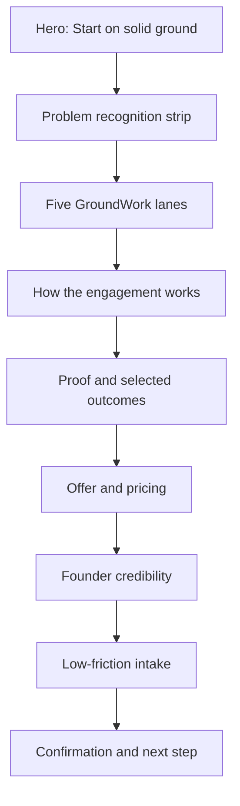

# Mission GroundWork Product Build Pack v1

**Status:** Build-ready, not yet shipped  
**Primary outcome:** Convert the existing Vite/React service site into a polished conversion product with a clear backend contract, proof system, and review-controlled GTM launch.

## 1. Product promise

**Mission GroundWork helps nonprofit and mission-driven teams start complex work on solid ground before wasted effort, confused ownership, and preventable rework set in.**

Primary buyers:
- nonprofit executive directors and chiefs of staff;
- development and fundraising leaders;
- program and operations leaders;
- small teams beginning a launch, turnaround, campaign, system implementation, or cross-functional initiative.

Primary conversion action: **Request a GroundWork session**.

## 2. Visual direction

Design principles:
- grounded, warm, credible, spacious;
- premium without appearing corporate or inaccessible;
- evidence before claims;
- clear lanes instead of a generic consulting menu;
- human photography or illustrations only where they add context.

### Homepage visual flow



### Required UI states

1. **Hero**
   - Headline: Helping your team start on solid ground.
   - Supporting line: Clarify the work, align the people, and build the operating foundation before execution gets expensive.
   - Primary CTA: Request GroundWork.
   - Secondary CTA: See the five lanes.

2. **Recognition strip**
   - “The work is important, but ownership is fuzzy.”
   - “The team is moving, but not in the same direction.”
   - “The launch has activity, but no operating spine.”

3. **Five lanes**
   - Executive GroundWork
   - Development GroundWork
   - Program GroundWork
   - Communications GroundWork
   - Operations GroundWork

4. **Proof module**
   - claim;
   - operating context;
   - action taken;
   - measurable result;
   - source or case-study link.

5. **Intake confirmation**
   - summarize the submitted need;
   - state expected response window without inventing availability;
   - provide a copyable request brief;
   - do not expose private information publicly.

## 3. Frontend implementation map

Existing component | Required refinement
---|---
`Header` | Sticky navigation, mobile menu, one primary CTA
`Hero` | Stronger recognition language, visual proof cue, responsive layout
`Process` | Replace generic steps with Diagnose → Align → Build the GroundWork → Handoff
`Lanes` | Add buyer, trigger, deliverable, and outcome for each lane
`Promise` | Convert promises into explicit service standards
`Pricing` | Separate entry offer, core sprint, and scoped engagement without unsupported scarcity
`Bio` | Lead with relevant operating proof, not autobiography
`ContactForm` | Structured intake, validation, consent, confirmation state, spam protection
`Footer` | Legal identity, privacy, contact path, social/proof links

## 4. Backend handoff contract

### Required services

1. **Lead intake API**
   - endpoint: `POST /api/intake`;
   - validate required fields server-side;
   - rate limit and reject obvious spam;
   - store only necessary contact and project information;
   - return a request ID and safe confirmation payload.

2. **Data model**

```text
Lead
- id
- created_at
- name
- email
- organization
- role
- selected_lane
- project_summary
- desired_outcome
- urgency_band
- referral_source
- consent_to_contact
- status
- notes_private
```

3. **Operational states**
   - New
   - Qualified
   - Discovery scheduled
   - Proposal sent
   - Won
   - Not now
   - Closed

4. **Notifications**
   - send internal notification after verified intake;
   - send user confirmation without exposing internal notes;
   - log delivery failures;
   - never claim a message was delivered unless the provider confirms it.

5. **Analytics events**
   - hero CTA click;
   - lane viewed;
   - pricing viewed;
   - intake started;
   - intake submitted;
   - confirmation copied;
   - external scheduling link opened.

6. **Security and privacy**
   - environment variables for credentials;
   - no secrets in the repository;
   - least-privilege Supabase policies;
   - consent language near submission;
   - deletion and correction path;
   - no sensitive client stories without permission.

## 5. Acceptance criteria

The technical team may mark the build ready only when:
- mobile, tablet, and desktop layouts pass visual inspection;
- every CTA has a real destination;
- intake validation works on client and server;
- failed submissions produce a useful recovery state;
- analytics events are verified in a test environment;
- accessibility checks cover contrast, keyboard navigation, labels, focus, and reduced motion;
- no unsupported outcome, client, or demand claim appears;
- build, lint, and typecheck pass;
- the deployed URL and commit SHA are recorded.

## 6. GTM launch plan

### Offer ladder

1. **GroundWork Diagnostic** — low-friction entry assessment.
2. **GroundWork Sprint** — focused alignment and operating-foundation engagement.
3. **GroundWork Build** — scoped implementation support.
4. **GroundWork Stewardship** — limited follow-through and operating review.

Pricing remains review-controlled until the current economics and delivery capacity are verified.

### Launch sequence

Phase | Action | Evidence required
---|---|---
Recognition | Publish problem-language content and collect replies | comments, saves, responses, intake language
Proof | Release one inspectable case or operating artifact | public URL or permissioned proof pack
Offer | Publish the diagnostic and sprint path | working service and inquiry URL
Conversation | Direct warm outreach to relevant contacts | replies or booked conversations
Refinement | Revise based on real objections and language | change log and performance evidence

### Channel roles

- **LinkedIn:** authority, case evidence, operator lessons, warm-door conversion.
- **Instagram:** visual frameworks, carousels, short recognition posts.
- **YouTube/Shorts:** practical breakdowns and before/after operating examples.
- **Substack:** substantial field notes and reusable frameworks.
- **Email:** permission-based follow-up and service conversion.

## 7. Trust-band publishing rules

Every post must:
- distinguish experience from universal fact;
- avoid invented clients, testimonials, demand, or results;
- cite or link proof when making a measurable claim;
- protect private relationships and organizations;
- provide useful content even when no purchase occurs;
- use a direct CTA only when the destination works;
- remain in Draft or Review until a human approves it.

## 8. FTM: first tangible milestone

**FTM-01:** A deployed Mission GroundWork page with one verified intake submission from a test account, one functioning confirmation, and one recorded analytics event.

Required receipt bundle:
- deployed URL;
- commit SHA;
- screenshot set for desktop and mobile;
- test submission ID;
- analytics verification;
- rollback instructions.

## 9. Rollback

- Revert the commit that introduces this file to remove the build pack.
- Frontend work should be isolated on a feature branch before merge.
- Database changes require versioned migrations and reversible down steps.
- Publishing records must retain prior copy and asset references.
