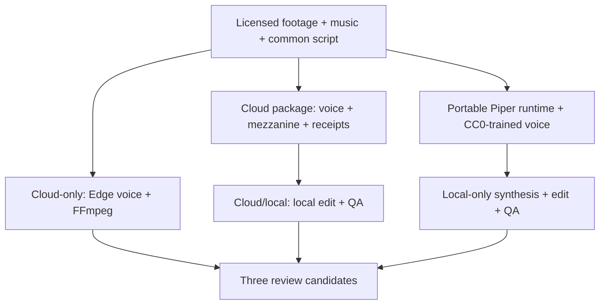

# Mission GroundWork — three-path media trial

Date: 2026-08-11  
GitHub draft PR: https://github.com/mozartg/missiongroundwork/pull/12  
Publishing status: **disabled; human approval required**

## Outcome

The repository can now produce a rights-documented vertical video, its reusable visual/audio inputs, objective media receipts, and a portable local neural-voice kit. That was not possible when execution stopped before the first workflow step or when output consisted of a text-only image.

This trial does **not** equate a green workflow with high creative quality. The first cloud encode passed technical checks but failed visual inspection because automatic subtitles became oversized stacked words. It was rejected and rebuilt with three manually timed statements in fixed safe areas.

## The three executed paths

| Candidate | Runtime boundary | Voice | Assembly | Distinguishing result |
|---|---|---|---|---|
| A — cloud-only | GitHub-hosted runner | Edge TTS `en-US-AndrewNeural` | FFmpeg in GitHub Actions | Simplest repeatable cloud artifact; concise centered lower-third statements |
| B — cloud/local | Cloud voice and input packaging; local edit/QA | Same Edge voice | Local FFmpeg | Strongest editorial hierarchy: motion reframe, restrained wordmark, three staged action panels |
| C — local-only runtime | Local synthesis, edit, mix, and QA | Piper `en_US-joe-medium` | Local FFmpeg | No media-generation API at runtime; warmer grade and ownership/next-step/support system |

All paths use the same script, Pexels footage, and MusicLFiles track so the difference is attributable to the voice/edit workflow rather than changed subject matter.

## Causal failures and impact

| Cause | Direct evidence | Resulting impact | Resolution | What became possible |
|---|---|---|---|---|
| Private Actions execution/billing gate | Jobs failed before media steps | No source acquisition, narration, render, or artifact | Executed the bounded media trial in the public `missiongroundwork` repository | Actual licensed media artifacts and receipts |
| Narration stream consumed twice in FFmpeg graph | `voice matches no streams` at the mix step | Cloud encode stopped after the mezzanine | Split normalized voice into ducking and final-mix branches | Voice-led music ducking and a complete MP4 |
| Auto subtitle styling ignored the intended hierarchy | Frame inspection showed stacked oversized words covering faces | Technically valid but unusable creative output | Replaced verbatim auto-captions with three manually timed safe-area statements | Readable text, intact subject framing, reliable mobile layout |
| Restricted sandbox lacked `/proc/self/exe` | Piper loaded the model, then aborted resolving its executable path | Local neural synthesis could not start | Supplied explicit data/model paths and patched a sandbox-only copy of the lookup constant | Fully local 16.39-second neural narration without a media API |

## Objective verification

| Candidate | Duration | Video | Audio | Measured integrated loudness | True peak | Black-frame finding |
|---|---:|---|---|---:|---:|---|
| A | 14.30 s | H.264, 1080×1920, 30 fps, yuv420p | AAC | −14.98 LUFS | −0.97 dBTP | No ≥1.2 s black segment detected |
| B | 14.30 s | H.264, 1080×1920, 30 fps, yuv420p | AAC | −14.72 LUFS | −0.95 dBTP | No ≥1.2 s black segment detected |
| C | 13.50 s | H.264, 1080×1920, 30 fps, yuv420p | AAC | −15.56 LUFS | −0.96 dBTP | No ≥1.2 s black segment detected |

Frame inspection was performed at approximately 2, 7, and 12 seconds for every candidate. The second cloud run's automatic subtitles were rejected. The retained candidates show no clipped titles, broken word wrapping, or essential text outside the 90 px horizontal / 150 px vertical safe region.

Objective verification establishes compatibility and catches visible failures; it does not establish voice authenticity or brand fit. Those remain human judgments. Recommended review order: **B, C, A**.

## Workflow map

## Reproduction

1. Open draft PR #12 and run `Mission GroundWork media trials`.
2. Download `mission-groundwork-cloud-package` and `mission-groundwork-local-voice-kit`.
3. Extract them as `cloud-package/` and `local-voice-kit/`.
4. Run `media/high-quality/build-local-candidates.sh` from their parent directory.
5. Review MP4s and the ffprobe, loudness, black-detection, checksum, source, and license receipts.

No workflow publishes to a social or media platform.

